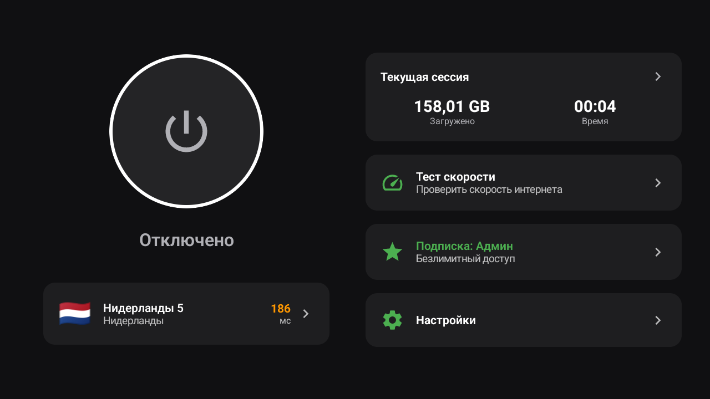
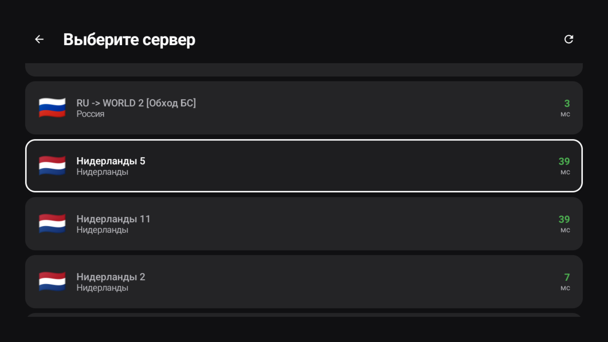
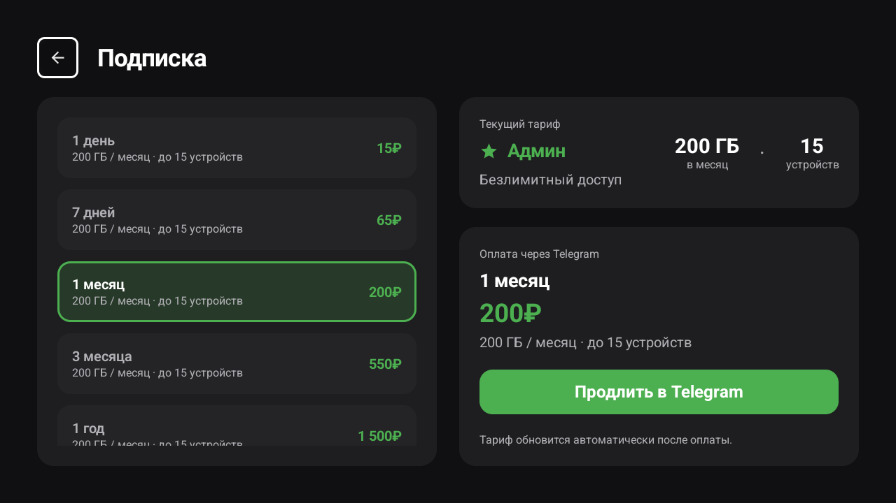
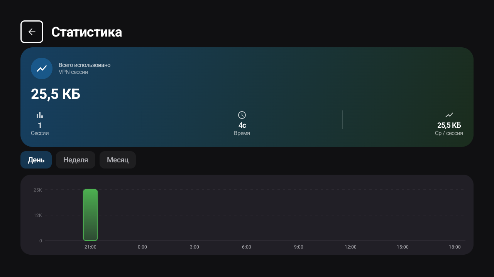
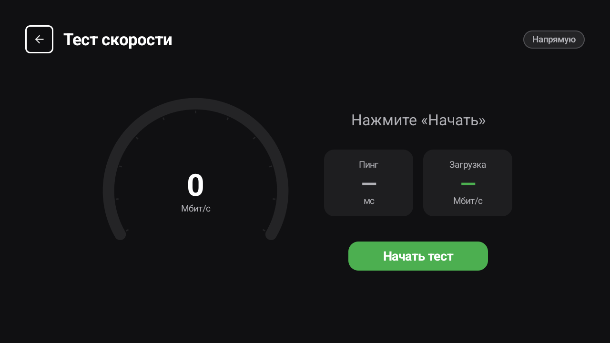
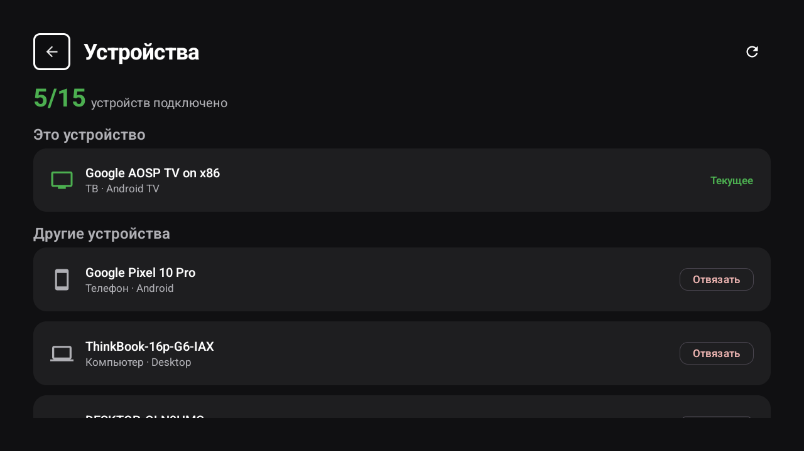
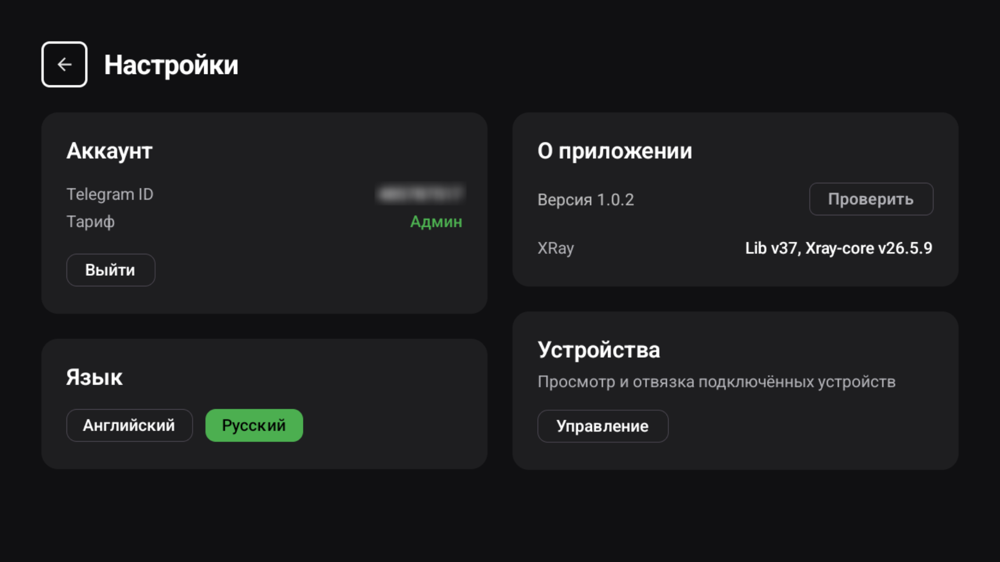

# ToBeVPN for Android TV

**VPN-клиент для Android TV с подпиской, выбором серверов и встроенными обновлениями — управление пультом.**

---

## Что это

ToBeVPN TV — нативный клиент к VPN-сети для телевизоров и приставок на Android TV. Защищённое подключение, управление подпиской, привязка устройства через QR, выбор серверов с пингом и встроенный обновлятор — всё это в leanback-интерфейсе, полностью управляемом с пульта (D-pad).

## Главное

| | |
|--|--|
| 🛡️ **Защищённое подключение** | Современный протокол с маскировкой трафика, системный VPN через TUN |
| 📺 **Leanback UI** | Интерфейс под телевизор, полная навигация пультом (D-pad) |
| 🔐 **Привязка по QR** | Вход без логина/пароля — сканирование QR камерой телефона |
| 💳 **Подписка** | Текущий тариф, лимиты, продление и покупка через Telegram (QR) |
| 🌍 **Выбор сервера** | Список нод с пингом, флагами и статусом online / недоступен |
| 🖥️ **Управление устройствами** | Просмотр и отвязка привязанных устройств |
| 🚦 **Speed test** | Замер скорости, в том числе через активный туннель |
| 📈 **Статистика** | Локальные сессии, трафик и длительность подключения |
| 🔄 **Обновления** | Google Play обновляет магазинную сборку; APK с GitHub сохраняет встроенное обновление |
| 🌐 **RU / EN** | Переключение языка интерфейса |
| 🔒 **Шифрование данных** | Локальная БД зашифрована, ключ в Android Keystore |
| 🛟 **Fallback proxy** | При недоступности основного бэкенда — автоматический повтор через резервный маршрут |

## Скриншоты

  <table>
    <tr>
      <td align="center"><b>Главный экран</b></td>
      <td align="center"><b>Серверы</b></td>
      <td align="center"><b>Подписка</b></td>
    </tr>
    <tr>
      <td></td>
      <td></td>
      <td></td>
    </tr>
    <tr>
      <td align="center"><b>Статистика</b></td>
      <td align="center"><b>Тест скорости</b></td>
      <td align="center"><b>Устройства</b></td>
    </tr>
    <tr>
      <td></td>
      <td></td>
      <td></td>
    </tr>
    <tr>
      <td align="center"><b>Настройки</b></td>
      <td></td>
      <td></td>
    </tr>
    <tr>
      <td></td>
      <td></td>
      <td></td>
    </tr>
  </table>

## Безопасность

- Локальная БД зашифрована, ключ хранится в аппаратном Android Keystore.
- Чувствительные данные (токены, ключ подписки) исключены из резервного копирования.
- Backend-хосты не хранятся в исходниках — подставляются при сборке.
- Авторизация без долгоживущих токенов на устройстве.

## Связанные репозитории

- **Android-клиент:** [ToBeVPN-Android](https://github.com/Shoolife/ToBeVPN-Android) — нативный клиент для телефонов
- **Desktop-клиент:** [ToBeVPN-Desktop](https://github.com/Shoolife/ToBeVPN-Desktop) — Linux / Windows

## Roadmap

- [ ] Поддержка протокола Hysteria
- [ ] Auto-server selection по latency
- [ ] Виджет быстрого подключения на главном экране Android TV
- [ ] Поддержка пульта с голосовым вводом для поиска сервера

## Contributing

Issue welcome. PR — лучше предварительно обсудить через issue. Коммиты — present tense, conventional commits не обязательны но приветствуются.

## Лицензия

Проприетарное приложение. Исходный код предоставляется для прозрачности и self-host'инга — коммерческое использование/перепродажа запрещены.

---

  Сделано с ❤️ командой <b>ToBeVPN × Meow VPN</b>

